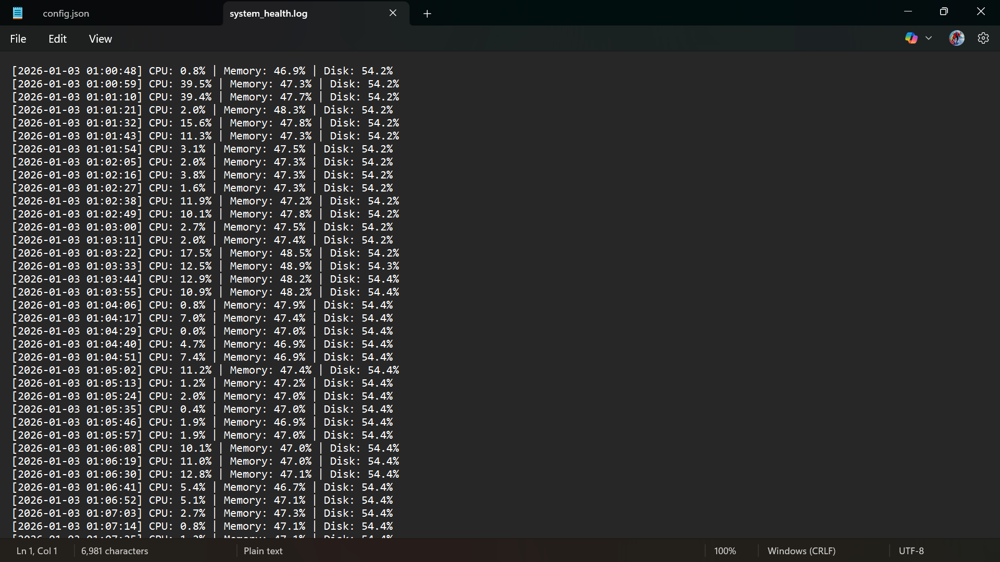

# System Health Monitoring Tool

## Overview
A Python-based system monitoring tool that tracks CPU, memory, and disk usage in real time and logs system health data.

## Features
- Monitors CPU, RAM, and disk utilization
- Logs system statistics with timestamps
- Raises alerts when usage exceeds defined thresholds

## Technologies Used
- Python
- psutil

## Use Case
Useful for basic system monitoring in IT operations and infrastructure environments.

## How to Run
1. Install dependencies:
   pip install -r requirements.txt
2. Run the script:
   python monitor.py

## Configuration
Thresholds and monitoring interval can be configured using `config.json` without modifying source code.

## Sample Output

